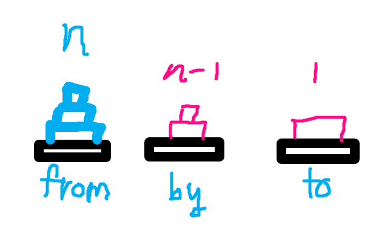

# WK.1

# BOJ 1914 하노이탑 
* 53696KB 468ms
* 자바 입출력에 익숙해지려고 자바로 풀어봤다.
- [ ] N의 크기를 확인 하였는가?
- [x] 문제 제약사항을 확인 하였는가?
- [x] 시간복잡도를 계산 할 수 있는가?
- [ ] 적절한 자료구조 활용하였는가?
- [x] 핵심 알고리즘을 구현할 수 있는가?
- [x] 문제를 풀었는가?

### 핵심 알고리즘
* 재귀 호출
* 강의에서 말했던 flat하게 생각하기


* from 에서 to로 가장 큰 원판을 옮기려 하면 by에 n-1개의 원판을 올려놓아야한다.
-> hanoi(n-1)의 이동 발생
* 가장 큰 원판 이동
-> hanoi(1) = 1번의 이동
* by에 있는 n-1개의 원판을 to로 이동
-> hanoi(n-1)의 이동 발생   

### 점화식

  ```
  h(n) = 2*h(n-1) + 1   
  양변에 + 1   
  h(n) + 1 = 2*(h(n-1) + 1)   
  h(n-1) + 1 = 2*(h(n-2) + 1)   
  ...   
  -> h(n) + 1 = 2^n-1*(h(1) + 1) = 2^n   
  -> h(n) = 2^n -1   
  ```

* 재귀는 단계별로 flat하게 생각 ( A에서 C로 하노이 이동 )
* 첫번째로 n-1개를 A에서 B로 이동
  ```java
  hanoi(N-1, from, to, by)
  ```
* 두번째로 1개를 A에서 C로 이동
  ```java
  bw.write(from + " " + to + "\n");
  ```
* 세번째로 n-1개를 B에서 C로 이동
  ```java
  hanoi(n-1, by, from, to)
  ```
   
* 기저 조건에 도달하면
  ```java
  if(num == 1) {
    bw.write(from + " " + to + "\n");
  }
  ```

### Comment
* 처음에 틀렸습니다 뜨고 N범위를 보니까 100까지라서 아차싶었다.
* BufferedWriter 써보려고 자바로 한건데 long에 Long에 난리를 치다가 BigInteger라는 무한대도 표현 가능한 자료형이 있는 걸 찾음..
* 근데 이것도 제출해서 통과는 되는데 막상 IntelliJ에서 18~20까지 값이 이상하게 출력된다. 아마 자바 버전 문제(??) 
   
# BOJ 10814 나이순 정렬
* 142056KB 520ms
- [x] N의 크기를 확인 하였는가?
- [x] 문제 제약사항을 확인 하였는가?
- [x] 시간복잡도를 계산 할 수 있는가?
- [x] 적절한 자료구조 활용하였는가?
- [x] 핵심 알고리즘을 구현할 수 있는가?
- [x] 문제를 풀었는가?

### 핵심 알고리즘
  ```python
  member.sort(key = lambda x : (x[0], x[2]))
  ```
### Comment
* 재활에 알맞는 문제였다.
* 수업 시간에 했던 람다 정렬을 사용함

# BOJ 15661 링크와 스타트
* 119168KB 2916ms
- [ ] N의 크기를 확인 하였는가?
- [x] 문제 제약사항을 확인 하였는가?
- [x] 시간복잡도를 계산 할 수 있는가?
- [ ] 적절한 자료구조 활용하였는가?
- [x] 핵심 알고리즘을 구현할 수 있는가?
- [x] 문제를 풀었는가?

### 핵심 알고리즘
* visited 배열이나 비트를 활용해서 각 팀에 속하는 인원을 체크한 후 기저조건에서 해당 인원들의 능력치를 합해준다.
  ```python
  # 각 팀에 속하는지를 판별할 visited
  visited = [0]*n
  visited = 0b00000000
  ```
  ```python
  # 팀을 구성하는 함수 teaming, 재귀를 통해 모든 경우의 수를 구성한다. itertools의 조합을 사용해도 될 것 같다.
  def teaming(cnt):
    if cnt == n:
        score()
        return
    visited[cnt] = 1
    teaming(cnt + 1)
    visited[cnt] = 0
    teaming(cnt + 1)

  def teaming(cnt):
    global visited
    if cnt == n:
        score()
        return
    visited = visited | (base << cnt)
    teaming(cnt + 1)
    visited = visited ^ (base << cnt)
    teaming(cnt + 1)
  ```
  ```python
  # 기저조건에서 점수를 구할 score 함수의 점수 합산 부분
  for i in range(n-1):
      for j in range(i+1, n):
          if visited[i] and visited[j]:
              start += status[i][j] + status[j][i]
          elif not visited[i] and not visited[j]:
              link += status[i][j] + status[j][i]
  
  for i in range(n-1):
      for j in range(i+1, n):
          if visited & (base << i) and visited & (base << j):
              start += status[i][j] + status[j][i]
          elif not visited & (base << i) and not visited & (base << j):
              link += status[i][j] + status[j][i]
  ```

* 그 값이 최소치를 찍는 경우를 출력한다.

### Comment
* 뭔가 문제가 낯익어서 찾아보니 예전에 비슷한 문제였던 14889번 스타트와 링크를 풀었었다.
* 이 문제의 경우는 N이 항상 짝수이고 각 팀이 N/2명씩 배정 되야 한다는 점이 차이점이었다.
* 이 때는 아예 teamA, teamB라는 배열을 따로 생성해서 인덱스를 넣어주고 명수 체크를 하고 기저조건에서 합하는 식으로 풀었다.
* 비트마스킹으로도 풀어봤는데 메모리도 더 많이 먹고 시간도 더 오래걸렸다 (?) 내가 비트마스킹을 안해봐서 뭔가 잘못한거 같다..
   

# BOJ 11725 트리의 부모 찾기
* 129912kb 300ms
- [x] N의 크기를 확인 하였는가?
- [x] 문제 제약사항을 확인 하였는가?
- [ ] 시간복잡도를 계산 할 수 있는가?
- [x] 적절한 자료구조 활용하였는가?
- [x] 핵심 알고리즘을 구현할 수 있는가?
- [x] 문제를 풀었는가?

### 핵심 알고리즘
* 트리의 인접정보를 입력 받는데 이것을 어떻게 입력받는가가 중요한 것 같다.
* parent[] 를 방문 여부 체크 겸 답 저장용으로 사용했음
  
  ```python
  while dq:
    cur = dq.pop()
    for i in relation[cur]:
        if not parent[i]:
            dq.append(i)
            parent[i] = cur
  ```
### Comment
* 처음에 생각없이 인접 행렬로 했다가 메모리 터지고 생각을 했다.
* 아 이건 대책없이 100000^2 로 하면 안되는구나
* 그래서 인접 정보를 딕셔너리에다 넣을 생각을 했는데 넣은 것 까지는 좋았는데 하고 나서 조회할 때 또 in 키워드로 리소스를 왕창 빼먹어서 메모리 터짐
* 수업시간에 인접 리스트를 배우고 기억이 복구됐다.
* 재활이 필요함...

